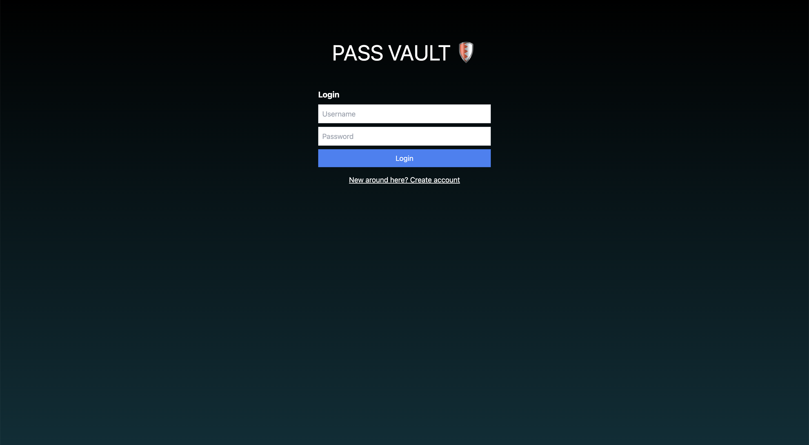
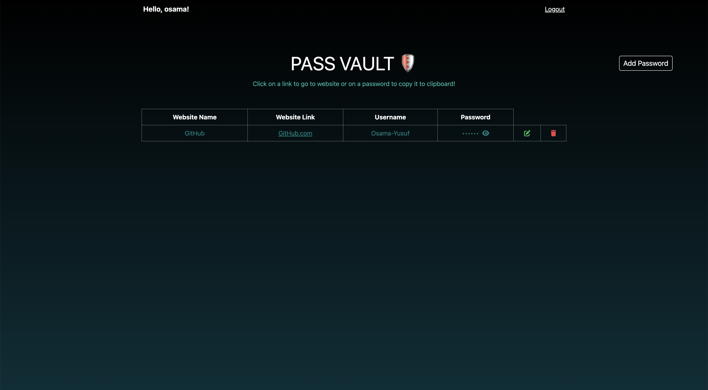

# LOCAL PASSVAULT

**LOCAL PASSVAULT** is a simple and secure password manager designed to help users store and manage their website credentials securely. Built with React and TailwindCSS, it provides a clean and responsive user interface for easy management of passwords.

## Screenshots




## Features

* **User Registration and Login**: register and login to manage your passwords.
* **Add, Edit, and Delete**: Easily add, modify, or remove password entries.
* **Local Storage**: Utilizes browser's local storage to keep your data safe on your own device.
* **No Backend Required**: Runs entirely in the browser without the need for a backend server.

This project uses several open-source packages:
* [React](https://reactjs.org/)
* [TailwindCSS](https://tailwindcss.com/)
* [FontAwesome](https://fontawesome.com/) for icons
* [Toastify-JS](https://github.com/apvarun/toastify-js) for notifications

## Installation

Clone the repository to your local machine:

```bash
git clone https://github.com/osama-yusuf/local-passvault.git
cd local-passvault
```

Since this project is purely frontend, open the project directory in a development server. You can use Node.js `http-server` or Python's simple HTTP server. Here's how you can do it with `http-server`:

```bash
npm install -g http-server  # Install http-server globally
http-server . -o            # Run a server in your project directory and open in browser
```

Or use the vscode live server

## Usage

1. **Open the project**: Navigate to the local server URL provided by `http-server`, typically `http://localhost:8080`.
2. **Register / Login**: Use the interface to create a new account or log in with an existing account.
3. **Manage Passwords**: Add, edit, or delete password entries as needed.

## Contributing

Contributions are what make the open-source community such an amazing place to learn, inspire, and create. Any contributions you make are **greatly appreciated**.

1. Fork the Project
2. Create your Feature Branch (`git checkout -b feature/AmazingFeature`)
3. Commit your Changes (`git commit -m 'Add some AmazingFeature'`)
4. Push to the Branch (`git push origin feature/AmazingFeature`)
5. Open a Pull Request

## License

Distributed under the MIT License. See `LICENSE` for more information.

## Contact

[Osama Yusuf](osama9mohamed5@gmail.com)
[Project Link](https://github.com/osama-yusuf/LOCAL-PASSVAULT)


### Todo

- [ ] get the data based on the current logged in user (I assumed that there won't be two users using the same pc, so i skipped it)
- [ ] add an import/export to json/csv 
  - [ ] for all current passwords
  - [ ] or as per user selection of passwords  
- [ ] add group/category and nested group/category of passwords
- [ ] Search box to search with category/user/website
- [ ] enhance security by 
  - [ ] encrypting the passwords before setting them inside the localstorage
  - [ ] limit loggged in session length
- [ ] enhance add/edit modal UI/UX
- [ ] generate password

inspiration:
- [LocalVault by ssambender](https://github.com/ssambender/LocalVault)
- [password-manager by mrdcvlsc](https://github.com/mrdcvlsc/password-manager)
